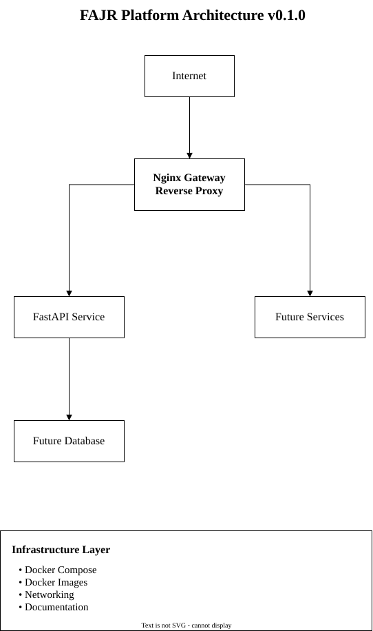

# Fajr Architecture

Fajr uses a modular architecture designed to evolve from a local development environment into a cloud-native production platform.

The current **v0.1.0** release represents the **Foundation** stage.

---

## Platform Overview



The current platform consists of:

- FastAPI application
- Docker containerization
- Docker Compose
- Nginx gateway
- Application health endpoint

Future releases will introduce networking, observability, security, Kubernetes, cloud infrastructure, and AI workloads.

---

## Repository Structure


The repository separates application code from infrastructure and platform modules.

```text
fajr/
├── applications/
├── infrastructure/
├── nginx/
├── monitoring/
├── security/
├── scripts/
├── docs/
└── README.md
```

This separation allows individual components to evolve independently while remaining part of the overall platform.

---

## Request Flow


At the Foundation stage, an incoming HTTP request follows this general path:

```text
Client
   │
   ▼
Nginx Gateway
   │
   ▼
FastAPI Service
   │
   ▼
Application Endpoint
   │
   ▼
HTTP Response
```

Nginx acts as the platform's edge gateway and forwards requests to the appropriate application service.

---

# Platform Components

## FastAPI

FastAPI provides the initial application workload used to validate the platform infrastructure.

Current capabilities include:

- HTTP API
- Health endpoint
- Interactive API documentation
- Application configuration

See the [FastAPI Service documentation](../applications/FastAPI/README.md).

---

## Docker

Docker packages platform services into portable containers.

The current platform uses Docker for:

- Application packaging
- Runtime isolation
- Reproducible environments
- Container networking

---

## Docker Compose

Docker Compose provides local orchestration for the current platform.

It is responsible for:

- Starting services
- Creating networks
- Connecting containers
- Managing environment configuration
- Managing service dependencies

See the [Docker Compose documentation](../infrastructure/compose/README.md).

---

## Nginx Gateway

Nginx provides the initial edge gateway.

The current implementation establishes the reverse-proxy foundation.

The gateway will eventually support capabilities such as:

- Path routing
- Load balancing
- TLS
- Caching
- Compression
- Rate limiting
- AI traffic management

See the [Nginx documentation](../nginx/README.md).

---

# Architecture Evolution

Fajr is intentionally designed to evolve incrementally.

```text
v0.1.0
Foundation
    │
    ▼
v0.2.0
Networking
    │
    ▼
v0.3.0
Container Platform
    │
    ▼
v0.4.0
Traffic Management
    │
    ▼
v0.5.0
Security
    │
    ▼
v0.6.0
Observability
    │
    ▼
v0.7.0
Applications
    │
    ▼
v0.8.0
Kubernetes
    │
    ▼
v0.9.0
Cloud Infrastructure
    │
    ▼
v1.0.0
Production Platform
```

The architecture diagrams will evolve alongside these milestones. The source files are stored under `docs/diagrams/`, and rendered SVG assets are available in `docs/assets/`.
